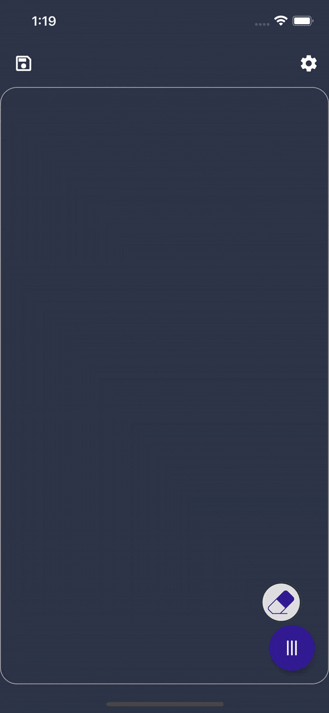

# Painter
Flutter Mobile Application for Android/IOS

A light weight drawing application, it provides you with a canvas and a pen with some options.
It enables you to illustrate something to a client, or maybe save a draft for later? 
Available options:

# Features:
- Undo
- Redo
- Clear
- Restore
- Save to local storage
- Restore from local storage
- Change Pen Type
- Change Pen Color
- Change Pen Size
- Movable Eraser

# Concepts Used:
- OOP
- Animations [Open Container Transform especially]
- Widgets Modularization
- Widgets Repurposing
- Canvas and  Custom Painter
- Gesture Detector
- State Management [GetX]
- Local Storage [Shared Prefrences / Get Storage]
- Resizing Widgets on the fly
- Grouping and Managing Options [Speed Dial Package]

# Packages/Tools used:
- GetX, https://pub.dev/packages/get
- SVG images ,   https://pub.dev/packages/flutter_svg
- Animations,    https://pub.dev/packages/animations
- Speed Dial,    https://pub.dev/packages/flutter_speed_dial
- Color picker,  https://pub.dev/packages/flutter_colorpicker
- Icon Creation for Android/IOS
- Splash Screen creation for Android/iOS

